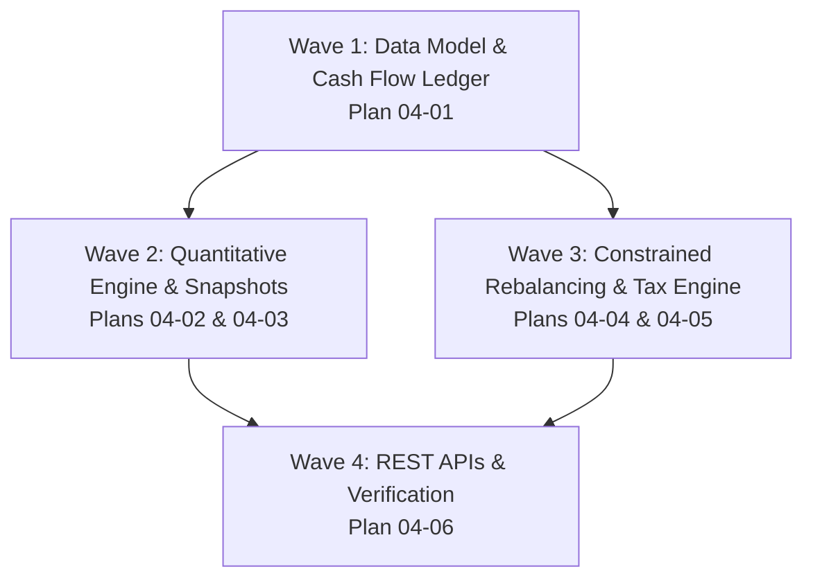

# Phase 4 Research: Portfolio Analytics That Actually Mean Something

**Target Phase:** Phase 4: Portfolio Analytics  
**Context Reference:** `.planning/phases/04-portfolio-analytics/04-CONTEXT.md`  
**Discussion Reference:** `.planning/phases/04-portfolio-analytics/04-DISCUSSION-LOG.md`  
**Target Architecture:** Python 3.12, Flask, PostgreSQL / Supabase, SQLAlchemy Core, Pydantic v2, Scipy 1.17, Numpy 2.3, Pandas 3.0  

---

## 1. Mathematical Formulations for Return & Risk Metrics in Python

### 1.1 Daily Time-Weighted Return (TWR) & Unitization
Under GIPS standards, external cash flows (deposits, withdrawals) must be isolated from investment management performance. We implement a unitized NAV model (starting base = 100.00 on Day 0):

```
Day 0 (Baseline):
  Total NAV_0 = Equity_0 + Cash_0
  Unit NAV_0  = 100.0000
  Units_0     = Total NAV_0 / 100.0000

Day t:
  1. Start of Day (SOD) Cash Flow Adjustment:
     If net external cash flow C_t occurs (deposit > 0, withdrawal < 0):
     ΔUnits_t = C_t / Unit NAV_{t-1}
     Units_t  = Units_{t-1} + ΔUnits_t

  2. End of Day (EOD) Valuation:
     Total NAV_t = Equity_t + Cash_t   (Cash_t includes C_t)
     Unit NAV_t  = Total NAV_t / Units_t

  3. Daily Return:
     r_t = (Unit NAV_t / Unit NAV_{t-1}) - 1.0

  4. Cumulative TWR:
     TWR = ∏_{i=1}^T (1 + r_i) - 1.0 = (Unit NAV_T / Unit NAV_0) - 1.0

  5. Annualized CAGR (Compound Annual Growth Rate):
     For total elapsed calendar days D = (date_T - date_0).days:
     If D >= 365:
         CAGR = (1 + TWR) ** (365.0 / D) - 1.0
     If D < 30:
         CAGR = None (flagged: "Insufficient history (<30d)")
     If 30 <= D < 365:
         CAGR = (1 + TWR) ** (365.0 / D) - 1.0 (flagged: "Annualized extrapolation")
```

### 1.2 Money-Weighted Return (XIRR) Numerical Root-Finding
Personalized rupee-weighted return solving for annual rate $r$ such that Net Present Value equals zero:
$$\text{NPV}(r) = \sum_{i=0}^n \frac{C_i}{(1 + r)^{\frac{d_i - d_0}{365}}} = 0$$
Where deposits are negative outflows ($-C$), withdrawals are positive inflows ($+C$), and current portfolio total NAV is treated as a terminal positive inflow ($+V_T$) on today's date $d_T$.

```python
import numpy as np
from datetime import date
from scipy import optimize


def calculate_xirr(cash_flows: list[tuple[date, float]], guess: float = 0.10) -> float | None:
    """
    Compute Money-Weighted Return (XIRR) using Newton-Raphson with Brentq fallback.
    cash_flows format: [(date_0, -amount), (date_1, amount), ...]
    """
    if len(cash_flows) < 2:
        return None

    dates, amounts = zip(*cash_flows)
    d0 = dates[0]
    years = np.array([(d - d0).days / 365.0 for d in dates], dtype=np.float64)
    amounts = np.array(amounts, dtype=np.float64)

    # Must have at least one positive and one negative cash flow
    if np.all(amounts <= 0) or np.all(amounts >= 0):
        return None

    def npv(r: float) -> float:
        return float(np.sum(amounts / ((1.0 + r) ** years)))

    def npv_prime(r: float) -> float:
        return float(np.sum(-years * amounts / ((1.0 + r) ** (years + 1.0))))

    # 1. Primary: Newton-Raphson for rapid convergence
    try:
        r_opt = optimize.newton(npv, guess, fprime=npv_prime, maxiter=100, tol=1e-6)
        if -0.999 < r_opt < 50.0:
            return float(r_opt)
    except Exception:
        pass

    # 2. Secondary fallback: Brent's bounded search on [-0.999, 10.0]
    try:
        r_opt = optimize.brentq(npv, -0.999, 10.0, maxiter=100)
        return float(r_opt)
    except Exception:
        pass

    # 3. Pure-python bisection fallback
    low, high = -0.999, 10.0
    for _ in range(100):
        mid = (low + high) / 2.0
        val = npv(mid)
        if abs(val) < 1e-5:
            return float(mid)
        if npv(low) * val < 0:
            high = mid
        else:
            low = mid
    return None
```

### 1.3 Annualized Sharpe and Sortino Ratios (Indian Conventions)
- **Indian Risk-Free Rate ($R_f$)**: Default 6.50% annualized (91-day / 364-day Indian T-Bill rate, configurable via `system_config`).
- **Daily Risk-Free Rate**: $r_{f, d} = (1 + R_f)^{1/252} - 1.0 \approx 0.0002500$ (or $R_f / 252$).
- **Indian Trading Days Scaling Factor**: $\sqrt{252}$ (NSE equity sessions per year).
- **Sortino Downside Semi-Variance**: Sum of squared negative deviations below the risk-free rate.

```python
def calculate_sharpe_sortino(
    daily_returns: np.ndarray, rf_annual: float = 0.065, min_warmup_days: int = 30
) -> tuple[float | None, float | None]:
    """
    Computes annualized Sharpe Ratio and Sortino Ratio.
    Returns (None, None) if sample size < min_warmup_days (30-day warmup gate).
    """
    n = len(daily_returns)
    if n < min_warmup_days:
        return None, None

    rf_daily = (1.0 + rf_annual) ** (1.0 / 252.0) - 1.0
    excess_returns = daily_returns - rf_daily
    mean_excess = np.mean(excess_returns)

    # Sharpe Ratio: Total portfolio standard deviation
    std_dev = np.std(daily_returns, ddof=1)
    sharpe = float((mean_excess / std_dev) * np.sqrt(252)) if std_dev > 1e-8 else None

    # Sortino Ratio: Downside semi-deviation below Rf
    downside_deviations = np.minimum(0.0, excess_returns)
    downside_dev = np.sqrt(np.mean(downside_deviations**2))
    sortino = float((mean_excess / downside_dev) * np.sqrt(252)) if downside_dev > 1e-8 else None

    return sharpe, sortino
```

### 1.4 Maximum Drawdown & High-Water Mark (HWM)
```python
@dataclass
class DrawdownMetrics:
    max_drawdown_pct: float
    current_drawdown_pct: float
    high_water_mark: float
    peak_date: date | None
    trough_date: date | None
    recovery_date: date | None
    is_recovered: bool


def calculate_drawdown_series(dates: list[date], unit_navs: np.ndarray) -> DrawdownMetrics:
    hwm_series = np.maximum.accumulate(unit_navs)
    drawdowns = (unit_navs - hwm_series) / hwm_series

    trough_idx = int(np.argmin(drawdowns))
    max_dd = float(drawdowns[trough_idx])

    # Find the peak date preceding the maximum drawdown trough
    peak_idx = int(np.argmax(unit_navs[: trough_idx + 1]))

    # Find recovery date (if recovered)
    recovery_idx = None
    peak_val = unit_navs[peak_idx]
    for i in range(trough_idx + 1, len(unit_navs)):
        if unit_navs[i] >= peak_val:
            recovery_idx = i
            break

    return DrawdownMetrics(
        max_drawdown_pct=round(max_dd * 100.0, 2),
        current_drawdown_pct=round(float(drawdowns[-1]) * 100.0, 2),
        high_water_mark=round(float(hwm_series[-1]), 4),
        peak_date=dates[peak_idx] if dates else None,
        trough_date=dates[trough_idx] if dates else None,
        recovery_date=dates[recovery_idx] if recovery_idx is not None else None,
        is_recovered=(recovery_idx is not None),
    )
```

### 1.5 Beta, Jensen's Alpha & Tracking Attribution
Relative to benchmark (Default: NIFTY 50 TRI, with NIFTY 500 TRI support):
```python
def calculate_beta_alpha(
    portfolio_returns: np.ndarray, benchmark_returns: np.ndarray, rf_annual: float = 0.065
) -> dict[str, float | None]:
    if len(portfolio_returns) < 30 or len(benchmark_returns) < 30:
        return {
            "beta": None,
            "alpha_annual_pct": None,
            "r_squared": None,
            "tracking_error_pct": None,
        }

    rf_daily = (1.0 + rf_annual) ** (1.0 / 252.0) - 1.0
    cov_matrix = np.cov(portfolio_returns, benchmark_returns)
    cov_pb = cov_matrix[0, 1]
    var_b = cov_matrix[1, 1]

    if var_b < 1e-9:
        return {
            "beta": None,
            "alpha_annual_pct": None,
            "r_squared": None,
            "tracking_error_pct": None,
        }

    beta = cov_pb / var_b
    mean_p = np.mean(portfolio_returns)
    mean_b = np.mean(benchmark_returns)

    # Jensen's Alpha (daily excess expected vs actual)
    alpha_daily = mean_p - (rf_daily + beta * (mean_b - rf_daily))
    alpha_annual = (1.0 + alpha_daily) ** 252 - 1.0

    # Correlation & R²
    std_p = np.std(portfolio_returns, ddof=1)
    std_b = np.std(benchmark_returns, ddof=1)
    corr = cov_pb / (std_p * std_b) if (std_p * std_b) > 1e-9 else 0.0
    r_squared = corr**2

    # Tracking Error & Information Ratio
    excess_vs_bm = portfolio_returns - benchmark_returns
    tracking_error = np.std(excess_vs_bm, ddof=1) * np.sqrt(252)

    return {
        "beta": round(float(beta), 3),
        "alpha_annual_pct": round(float(alpha_annual * 100.0), 2),
        "r_squared": round(float(r_squared), 4),
        "tracking_error_pct": round(float(tracking_error * 100.0), 2),
    }
```

---

## 2. Database Schemas & Migrations for Phase 4

### 2.1 `db/migrations/017_portfolio_snapshots.sql`
```sql
-- Migration 017: Portfolio Daily Snapshots
CREATE TABLE IF NOT EXISTS portfolio_daily_snapshots (
    id                          BIGSERIAL PRIMARY KEY,
    snapshot_date               DATE NOT NULL,
    user_id                     TEXT NOT NULL DEFAULT 'default',

    -- Valuation components
    total_equity_value          NUMERIC(15, 2) NOT NULL,
    cash_balance                NUMERIC(15, 2) NOT NULL,
    total_nav                   NUMERIC(15, 2) NOT NULL,

    -- Unitization (GIPS Time-Weighted Return)
    units                       NUMERIC(18, 6) NOT NULL DEFAULT 1.000000,
    unit_nav                    NUMERIC(15, 4) NOT NULL DEFAULT 100.0000,
    daily_return_pct            NUMERIC(8, 4),

    -- Benchmark comparison (Total Return Index)
    benchmark_name              TEXT NOT NULL DEFAULT 'NIFTY 50 TRI',
    benchmark_value             NUMERIC(15, 2),
    benchmark_daily_return_pct  NUMERIC(8, 4),

    -- Flow accounting & attribution
    net_external_flow           NUMERIC(15, 2) NOT NULL DEFAULT 0.00,
    gross_daily_return_pct      NUMERIC(8, 4),
    stt_drag_bps                NUMERIC(6, 2) DEFAULT 0.00,
    fee_drag_bps                NUMERIC(6, 2) DEFAULT 0.00,
    tax_drag_bps                NUMERIC(6, 2) DEFAULT 0.00,

    created_at                  TIMESTAMPTZ NOT NULL DEFAULT NOW(),

    CONSTRAINT uq_snapshots_user_date UNIQUE (user_id, snapshot_date),
    CONSTRAINT chk_positive_nav CHECK (total_nav >= 0),
    CONSTRAINT chk_positive_units CHECK (units > 0),
    CONSTRAINT chk_positive_unit_nav CHECK (unit_nav > 0)
);

CREATE INDEX IF NOT EXISTS idx_snapshots_user_date_asc
    ON portfolio_daily_snapshots (user_id, snapshot_date ASC);

CREATE INDEX IF NOT EXISTS idx_snapshots_user_date_desc
    ON portfolio_daily_snapshots (user_id, snapshot_date DESC);
```

### 2.2 `db/migrations/018_portfolio_cash_flows.sql`
```sql
-- Migration 018: Portfolio Cash Flows Ledger
CREATE TABLE IF NOT EXISTS portfolio_cash_flows (
    id                      BIGSERIAL PRIMARY KEY,
    user_id                 TEXT NOT NULL DEFAULT 'default',
    flow_date               DATE NOT NULL,
    flow_type               TEXT NOT NULL
                            CHECK (flow_type IN (
                                'DEPOSIT',
                                'WITHDRAWAL',
                                'DIVIDEND',
                                'CHARGE',
                                'INTEREST'
                            )),
    amount                  NUMERIC(15, 2) NOT NULL CHECK (amount > 0),
    units_affected          NUMERIC(18, 6),
    nav_per_unit            NUMERIC(15, 4),
    source                  TEXT NOT NULL DEFAULT 'MANUAL'
                            CHECK (source IN (
                                'MANUAL',
                                'AUTO_MARGIN_SYNC',
                                'CORPORATE_ACTION',
                                'BROKER_LEDGER'
                            )),
    external_reference      TEXT,
    notes                   TEXT,
    created_at              TIMESTAMPTZ NOT NULL DEFAULT NOW()
);

CREATE INDEX IF NOT EXISTS idx_cash_flows_user_date
    ON portfolio_cash_flows (user_id, flow_date ASC);

CREATE INDEX IF NOT EXISTS idx_cash_flows_type_date
    ON portfolio_cash_flows (flow_type, flow_date DESC);
```

---

## 3. Rebalancer Constraints & Indian Transaction Cost Modeling

### 3.1 Realistic Indian Regulatory & Broker Fee Schedule
For delivery trades in Indian equity on NSE via Zerodha:
- **Brokerage**: ₹0 for equity delivery.
- **Securities Transaction Tax (STT)**: 0.1% on buy delivery, 0.1% on sell delivery (rounded to nearest integer ₹1).
- **NSE Exchange Turnover Fee**: 0.00297% of trade value.
- **SEBI Turnover Charges**: 0.0001% (₹10 per crore).
- **Stamp Duty**: 0.015% on BUY only (rounded to nearest integer ₹1).
- **GST**: 18% applied strictly to *services* (`18% * (Brokerage + NSE Fee + SEBI Fee)`).
- **DP Charges**: ₹15.34 (₹13 + 18% GST) per scrip per day on SELL delivery.

### 3.2 Sizing Constraints in `src/analytics/rebalancer.py`
1. **Minimum Trade Value Filter (`min_trade_value = 2000`)**:
   - Suppresses sub-₹2,000 orders to eliminate fixed-fee drag.
   - **Exemption:** 100% position liquidations (`quantity == holding.quantity`) bypass the threshold to prevent orphaned dust holdings.
2. **Cash Reserve Constraint (`cash_buffer = max(0.02 * AUM, 5000)`)**:
   - `usable_cash = available_cash + total_sell_proceeds - cash_buffer`.
   - Buy orders cannot exceed `usable_cash`.
3. **Daily Turnover Cap (`turnover_cap = 0.15 * AUM`)**:
   - Actionable drift signals are sorted by $| \text{drift\_pct} |$ descending (severe breaches first).
   - Proposed buys + sells are budgeted against `turnover_cap`.
4. **Liquidity Guard (ADV Check)**:
   - Order size capped at $\le 1.0\%$ of the 20-day Average Daily Volume (ADV) on NSE:
     $$\text{max\_trade\_qty} = \lfloor 0.01 \times \text{ADV}_{20} \rfloor$$
5. **Tax-Aware Lot Selection (Loss-Harvesting First & 30-Day LTCG Protection)**:
   - Sequence for trimming overweight positions:
     1. Short-Term Capital Loss lots (`STCL`, highest % loss first to harvest tax shields).
     2. Long-Term Capital Loss lots (`LTCL`).
     3. Long-Term Capital Gain lots (`LTCG`, taxed at 12.5% vs 20%).
     4. Short-Term Capital Gain lots (`STCG`, `days_to_ltcg > 30`).
     5. **Near-LTCG Deferral:** Lots within 30 days of the 365-day LTCG threshold (`days_to_ltcg <= 30`) are deferred.

---

## 4. API Endpoints & Data Contracts

### 4.1 New REST Routes in `src/api/v1/blueprint.py`
- `GET /api/v1/analytics/performance`: Returns TWR, XIRR, Sharpe, Sortino, Drawdown, Beta, Alpha, and basis-point drag attribution.
- `GET /api/v1/analytics/snapshots`: Time series for frontend charting (Portfolio Unit NAV vs Benchmark NAV).
- `GET /api/v1/analytics/tax-harvesting`: Unharvested STCL/LTCL opportunities, FY realized LTCG, remaining ₹1.25L exemption, and Q4 gain harvesting suggestions.
- `GET /api/v1/portfolio/cash-flows` & `POST /api/v1/portfolio/cash-flows`: Managing deposits, withdrawals, dividends, and charges.
- `POST /api/v1/rebalance/preview`: Dry-run rebalance manifest with trade sizing reasons, cost breakdown (STT, DP, GST), tax liability estimates, and drag attribution.

---

## 5. Wave Decomposition Plan (Phase 4)



- **Plan 04-01 (Wave 1):** Historical NAV & Cash Flow Schema, Pydantic DTOs & Repository.
- **Plan 04-02 (Wave 2):** Quantitative Performance & Attribution Engine (`src/analytics/performance.py`).
- **Plan 04-03 (Wave 2):** Daily Snapshot Recorder, Margin Delta Sync & Baseline Backfill (`src/analytics/snapshot_recorder.py`).
- **Plan 04-04 (Wave 3):** Indian Transaction Cost Model & Rebalancer Constraints (`src/analytics/cost_calculator.py` & `src/analytics/rebalancer.py`).
- **Plan 04-05 (Wave 3):** Tax-Loss Harvesting & FY LTCG Exemption Tracker (`src/analytics/tax_guard.py`).
- **Plan 04-06 (Wave 4):** Analytics REST Endpoints & Complete Test Suite.
